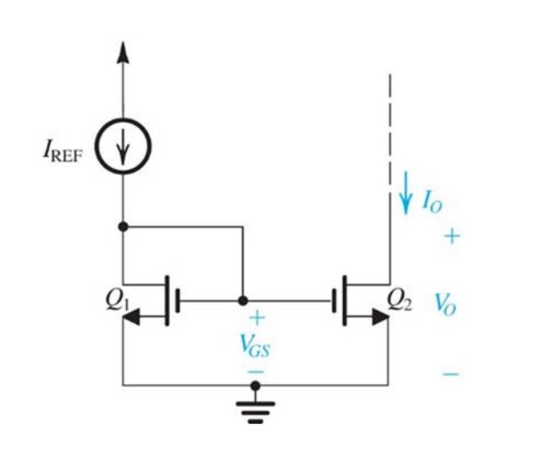

# How to pass Ηλεκτρονική Ι

Αυτό το αρχείο βρίσκεται στο github
(https://github.com/sotirismorf/how_to_thmmy/ilektroniki1)
Αν βρεις κάποιο λάθος, ή θέλεις να το βελτιώσεις, άνοιξε ένα issue, ή κάνε
fork και pull request.

Αν το κατέβασες από το THMMY, πιθανόν, την ώρα που το διαβάζεις, ήδη να έχουν γίνει βελτιώσεις, οπότε καλύτερα κατέβασε το ξανά απο εκεί.

### Περιεχόμενα

1. [Δίοδοι](#1.-δίοδοι)
2. [Τρανζίστορ](#2.-τρανζίστορ)
	1. [Τα είδη των τρανζίστορ](#2.1-τα-είδη-των-τρανζίστορ)
	2. [Ιδιότητες των τρανσίστορ](#2.2-ιδιότητες-των-τρανζίστορ)
		1. [Τρανζίστορ JFET](#2.2.1-τρανζίστορ-jfet)
		2. [Τρανζίστορ MOSFET](#2.2.2-τρανζίστορ-mosfet)
3. [Ενισχυτές](#3.-ενισχυτές)
	1. [Ενισχυτές FET](#3.1-ενισχυτές-fet)
		1. [Ενισχυτής κοινής πηγής](#3.1.1.-ενισχυτής-κοινής-πηγής)

## 1. Δίοδοι

## 2. Τρανζίστορ

### 2.1 Τα είδη των τρανζίστορ

##### Τρανζίστορ JFET:

Διαύλου n | Διαύλου p
|:-|:-|
 | 

##### Τρανζίστορ MOSFET:

Τύπος | Διαύλου n | Διαύλου p
|:-|:-|:-|
Αραίωσης |  | 
Πύκνωσης |  | 

##### Τρανζίστορ BJT:

Διαύλου n | Διαύλου p
|:-|:-|
 | 

### 2.2 Ιδιότητες των τρανζίστορ

#### 2.2.1 Τρανζίστορ JFET 
	- Διαύλου-n:
	- Διαύλου-p:
#### 2.2.2 Τρανζίστορ MOSFET 
- Αραίωσης
	- Διαύλου-n
	  $$k=k'\frac{W}{L}=μ_nC_{ox}\frac{W}{L}$$

	  $$V_{OV}=V_{GS}-V_t$$

	  $$i_d=\frac{1}{2}kV_{OV}^2$$
		
	  Για να άγει το τρανζίστορ:

	  $$V_{GS} \geqslant V_t$$

	  $$i_D=I_{DSS}(1-\frac{V_{GS}}{V_t})^2$$

	  Για να λειτουργεί στην ενεργό περιοχή

	  $$V_{DS} \geqslant V_{GS} - V_t$$

	- Διαύλου-p\
	  Για να άγει το τρανζίστορ:

	  $$V_{GS} < V_T$$

	  Για να λειτουργεί στην ενεργό περιοχή πρέπει:

	  $$V_{DS} < V_{GS} - V_T$$

	  Για να λειτουργεί στην ωμική περιοχή πρέπει:

	  $$V_{DS} \geqslant V_{GS} - V_T$$

	  Αν λειτουργεί στην ωμική περιοχή:

	  $$i_D=k[(V_{GS1}-V_t)V_{DS1}-\frac{V_{DS}^2}{2}]$$
- Πύκνωσης
	- Διαύλου-n
	- Διαύλου-p
- BJT

### 2.3 Τα είδη των ασκήσεων

#### 2.3.1 Άσκηση με JFET

- Για να άγει το τρανσίστορ, πρέπει:
$$V_{GS} \geqslant V_p$$
- Παίρνω τον τύπο:

$$i_D=I_{DSS}(1-\frac{V_{GS}}{V_p})^2$$

$$ I_{DSS}=V_p^2k/2$$

Από τον τύπο προκύπτει ένα τριώνυμο. Απορρίπτω την μία λύση χρησιμοποιώντας
την παραπάνω ανίσωση
- Αν χρειαστεί, παίρνω εξίσωση βρόχου, έτσι ώστε να προκύψει σύστημα, η
μερικές φορές λύνεται κατευθείαν.
- Σε περίπτωση που το ζητάει η το δίνει, θυμάμαι ότι για να λειτουργεί το
τρανσίστορ στην ενεργό περιοχή ισχύει:

$$V_{DS} \geqslant V_{GS} - V_p$$

#### 2.3.1 Άσκηση με MOSFET

##### Περίπτωση με καθρέπτη ρεύματος

Αν υπάρχει κάποιο βραχυκύκλωμα όπως σε τρανσίστορ, όπως στην παραπάνω εικόνα,
τότε έχω περίπτωση με καθρέπτη ρεύματος. Το πιο σημαντικό που πρέπει να θυμάμαι
είναι ότι ισχύει

$$I_{REF}=I_O$$

ή

$$I_{R}=I_{OUT}$$

ανάλογα με την άσκηση

Εξαιτίας αυτού, ισχύει:

$$V_G=V_D \Leftrightarrow V_{DS}=V_{GS}$$

- Αν υπάρχει καθρέπτης ρεύματος
- Τα σημεία λειτουργίας του τρανσίστορ είναι:

$$Q = (V_{GSQ},I_{DQ},Q_{DSQ})$$

- Και πάλι θυμάμαι τις ανισώσεις για το αν άγει και για το αν λειτουργεί
το τρανσίστορ στην ενεργό περιοχή.

### 2.2 MOSFET

Περιπτώσεις
- Διαύλου n: Έχω Vt
- Διαύλου p: Έχω Vp
- Καθρέπτης ρεύματος:
	- NA BALW FWTO.
	  Καταλαβαίνω ότι έχω καθρέπτη ρεύματος από το βραχυκύκλωμα.
	  Ισχύει x_1=x_2
	  Είδη καθρεπτών:
	- Καθρέπτης ρεύματος με τρανζίστορ n-MOS
	- Καθρέπτες ρεύματος για απορρόφηση (sink) και παροχή (source)
	  ρεύματος
	- Καθρέπτης ρεύματος Wilson
	- Τροποποιημένος καθρέπτης ρεύματος Wilson
	- Κασκοδικός καθρέπτης ρεύματος
- Υβριδικό ισοδύναμο
## 3. Ενισχυτές

### 3.1 Ενισχυτές FET

Υπάρχουν τρία είδη: κοινής πηγής, κοινής πύλης και κοινής εκροής

Κοινής πηγής | Κοινής πύλης | Κοινής εκροής
-|-|-
 |  |  

#### 3.1.1. Ενισχυτής κοινής πηγής

Αν ζητείται $V_{out}/V_{in}$ , μπορώ να πάρω εξίσωση κόμβων στο $D$

## Ερωτήσεις Θεωρίας

Οι ερωτήσεις προέρχονται [από αυτό το pdf](https://www.thmmy.gr/smf/index.php?action=tpmod;dl=item5483)

1. Πώς υπολογίζεται η θερμική τάση (τύπος) επαφής p-n και
ποια είναι η τιμή της σε θερμοκρασία δωματίου;

VT = kT/q = 26 mV (για Τ= 300Κ)

2. Με την αύξηση της θερμοκρασίας η χαρακτηριστική της
διόδου μετακινείται προς τα αριστερά ή δεξιά;

Αριστερά

3. Τι ονομάζουμε ευθεία φορτίου σε κύκλωμα με δίοδο; Ποια
είναι η έκφραση της για κύκλωμα με μια δίοδο, μια αντίσταση
R και μια πηγή τάσης Vs; Έχει θετική ή αρνητική κλίση;

• Ονομάζεται η ευθεία που περιγράφει την λειτουργία του
γραμμικού μέρους του κυκλώματος(και η οποία τέμνει την
χαρακτηριστική καμπύλη της διόδου στο σημείο Q-σημείο
λειτουργίας του κυκλώματος)
• iD = - (1/ RL) υD + V1 / RL
• Αρνητική κλίση

4. Πώς ορίζεται η δυναμική αντίσταση διόδου rD; Ποια είναι η
έκφραση της για δίοδο που διαρρέεται από ρεύμα ΙD;
Η δυναμική αντίσταση διόδου ορίζεται ως η αντίσταση
ασθενούς σήματος της διόδου.

(Sedra/Smith σελ.197)
D
r
T
D
D D
dV nV
r = = dI I

5. Ποιες παραδοχές διαχωρίζουν την ανάλυση μικρού ή
μεγάλου σήματος σε κύκλωμα διόδων;
Στην περίπτωση της απλής διόδου με μία αντίσταση R και μία
πηγή τάσης , όταν η υφίσταται μεταβολή κατά μία
ποσότητα ΔVDD, το ρεύμα ID και η τάση VD μεταβάλλονται κατά
ΔID και ΔVD αντίστοιχα. Στο μοντέλο του μικρού (“ασθενούς”)
σήματος, το ΔVD όταν παραμένει επαρκώς μικρό, το λαμβάνουμε
υπόψιν, ενώ στην ανάλυση μεγάλου σήματος το παραλείπουμε.
(Sedra/Smith σελ.195-197)

6. Σε καθαρή μορφή χωρίς προσμίξεις οι ημιαγωγοί είναι
καλοί αγωγοί του ρεύματος;

Όχι, διότι συμπεριφέρονται ως μονωτές
(Διαφάνειες 02, σελ. 16)

7. Πώς προκύπτουν ημιαγωγοί τύπου n ή τύπου p;
Με την εισαγωγή προσμίξεων στους ημιαγωγούς δημιουργούμε
ενεργειακές στάθμες μέσα στην απαγορευμένη περιοχή(ανάμεσα
στις ζώνες σθένους-αγωγιμότητας).
• Κοντά στη ζώνη σθένους-> Αποδέκτες (p-τύπου)
• Κοντά στη ζώνη αγωγιμότητας-> Δότες (n-τύπου)
(Διαφάνειες 02, σελ. 16)

8. Σε ποια βασική σχέση οφείλεται η ισορροπία της επαφής
pn;

Απάντηση:
Το ηλεκτρικό πεδίο που δημιουργείται από την μετακίνηση λόγω
διάχυσης των φορτίων εξισορροπεί την «δύναμη» της διάχυσης.
DD V DD V

9. Πώς εξηγείται η μονόπλευρη αγωγιμότητα της διόδου με
βάση την ύπαρξη της περιοχής φορτίων χώρου; Πότε
διευρύνεται ή συρρικνώνεται η περιοχή αυτή;
• Κοντά στην οριακή περιοχή επαφής των ημιαγωγών τύπου p
και n, λόγω της διαφοράς στις συγκεντρώσεις των φορέων, οι
οπές τείνουν να κινηθούν προς την περιοχή τύπου n και τα
ηλεκτρόνια προς την περιοχή τύπου p. Η κίνηση αυτή έχει ως
αποτέλεσμα την “απογύμνωση” των ατόμων των αποδεκτών
με συνέπεια τα άτομα των αποδεκτών να αποκτήσουν
αρνητικό φορτίο και τα άτομα των δοτών να αποκτήσουν
θετικό φορτίο. Αυτή η κίνηση εκατέρωθεν τις οριακής
επιφάνειας των περιοχών τύπου p και n, οδηγεί στην
ανασύνδεση των οπών και των ηλεκτρονίων (και τη
δημιουργία της ΠΦΧ), με αποτέλεσμα η περιοχή κοντά
σ'αυτήν την επιφάνεια να “απογυμνώνεται” από ελεύθερους
φορείς. Η περιοχή αυτή, ονομάζεται περιοχή αραίωσης, λόγω
της μικρής της συγκέντρωσης σε οπές και ηλεκτρόνια.
• Η ΠΦΧ διευρύνεται όταν το ρεύμα που ρέει είναι αμελητέο
και συρρικνώνεται για ροή μεγάλων ρευμάτων.
(Διαφάνειες 02, σελ. 26-27)

10. Υπάρχει όριο στην τιμή ανάστροφης τάσης σε μια απλή
δίοδο (όχι ειδικού σκοπού);
Ναι, υπάρχει, καθώς, η δίοδος εισέρχεται στην περιοχή διάσπασης
όταν η απόλυτη τιμή της ανάστροφης τάσης ξεπερνά ένα κατώφλι,
διαφορετικό για την εκάστοτε δίοδο, και αποκαλείται τάση
διάσπασης (breakdown voltage),VΖK. Η περιοχή αυτή, εκτός αν η
δίοδος είναι ειδικού σκοπού (δίοδος Zener) είναι καταστροφική.
Σε απλή δίοδο, λοιπόν, αν βάλω μια μεγάλη ανάστροφη τάση, το
εξάρτημα θα καεί, καθώς η δίοδος θα υπερβεί την τιμή ισχύος που
υπαγορεύουν οι προδιαγραφές της από την κατασκευαστή. 

11. Ποιες είναι οι δύο βασικές χωρητικότητες της διόδου και
ποια εμφανίζεται εντονότερα στην ορθή ή ανάστροφη πόλωση;
• Χωρητικότητα περιοχής αραίωσης: Μεγαλύτερη ανάστροφη
τάση-> μικρότερη χωρητικότητα περιοχής αραίωσης
• Χωρητικότητα διάχυσης: Αύξηση πυκνώτητας φορέων
μειωνότητας κοντά στην ένωση(εκτός περιοχής αραίωσης).
Σε ορθή πόλωση έχει τιμές στην τάξη nF, ενώ η
χωρητικότητα περιοχής αραίωσης είναι αμελητέα. Άρα η
χωρητικότητα διάχυσης εμφανίζεται εντονότερα στην ορθή
πόλωση.

(Διαφάνειες 02, σελ. 29)

12. Ποια είναι τα βασικά χαρακτηριστικά του τρανζίστορ
επίδρασης πεδίου FET;
 Στοιχείο με τρεις ακροδέκτες.
Έλεγχος εσωτερικού ηλεκτρικού πεδίου με την εφαρμογή
εξωτερικού δυναμικού στην πύλη (gate, G).
Το πεδίο αυτό ελέγχει την αγωγιμότητα μεταξύ των άλλων δύο
ακροδεκτών, της εκροής (drain, D) και της πηγής (source, S) και
επομένως και το ρεύμα που θα διέρχεται από αυτούς.
 Ένας τύπος φορέων (ηλεκτρόνια ή οπές) - μονοπολικό.
(Διαφάνειες 03, σελ. 7)
(1 )
t o
t
K
C
dQ C C
dV V
V
= =
-
d D
d
T
dQ I
C
dV nV
t
= =

13. Ποια τάση ονομάζεται τάση Early; (πως προκύπτει η τιμή
της από τις χαρακτηριστικές εξόδου;)
Αν οι χαρακτηριστικές εξόδου επεκταθούν προς τα αρνητικά, θα
συγκλίνουν σε μία τιμή. Αυτή η τιμή του δυναμικού (αρνητική),
ονομάζεται τάση Early
(Διαφάνειες 03, σελ. 28)

14. Ποιο είναι το φαινόμενο σώματος σε MOS τρανζίστορ.
Είναι το φαινόμενο, το οποίο επηρεάζει την τάση κατωφλίου Vt
αν η τάση μεταξύ πηγής και υποστρώματος VSB είναι διάφορη του
μηδενός. Ειδικότερα:
όπου,
Vt0: Τάση κατωφλίου για VSB = 0
γ: Παράμετρος φαινομένου σώματος
ΝΑ: η συγκέντρωση προσμίξεων του p τύπου υποστρώματος
Φf : φυσική παράμετρος
(Διαφάνειες 03, σελ. 29)

15. Ποια είναι η επίδραση της θερμοκρασίας στη λειτουργία
των ΜΟS;
Μείωση ρεύματος iD με την θερμοκρασία, αφού:
• Vt μειώνεται κατά 2 mV περίπου για κάθε 1οC αύξηση
θερμοκρασίας => Αύξηση ρεύματος iD με την θερμοκρασία.
• k’ μειώνεται με τη θερμοκρασία =>Μείωση ρεύματος iD με
την θερμοκρασία.
(Διαφάνειες 03, σελ. 30)
1
VA
l
=

16. Σε κύκλωμα MOS με πόλωση με αντιστάσεις γιατί
προτιμάται η πόλωση με αντίσταση στην πηγή;
• Στην πόλωση με αντίσταση πηγής Rs, για VG = σταθερό,
διαφορετικό VGS και διαφορετικά τρανζίστορ, το ρεύμα
διατηρείται σχετικά σταθερό (σε αντίθεση με την πόλωση με
σταθερή VGS, όπου έχουμε μεγάλη διαφορά ρευμάτων).
• Για VG = σταθερό, αν η VGS αυξηθεί με συνέπεια να αυξηθεί
το ID, τότε αυξάνεται η πτώση τάσης στην αντίσταση Rs, με
συνέπεια τη μείωση της VGS. Έχουμε, δηλαδή αρνητική
ανάδραση, η οποία συμβάλει στην σταθεροποίηση της
λειτουργίας του κυκλώματος.
(Διαλέξεις, Διαφάνειες 04, σελ. 14)

17. Σε ποια κυκλώματα χρησιμοποιείται ο καθρέπτης
ρεύματος και γιατί;
Στα ολοκληρωμένα κυκλώματα, για να αποφύγουμε τη χρήση των
αντιστάσεων(οι οποίες αυξάνουν την θερμοκρασία του
ολοκληρωμένου κυκλώματος και καταλαμβάνουν πολύ χώρο).
(Διαλέξεις)

18. Ποιο είναι το πλεονέκτημα της πηγής ρεύματος Widlar και
σε ποια κυκλώματα χρησιμοποιείται;
• Χρησιμοποιείται σε ολοκληρωμένα κυκλώματα για μικρά
ρεύματα
• Υλοποιείται με μικρές τιμές αντιστάσεων, κατάλληλες για
ολοκληρωμένα κυκλώματα
(Διαφάνειες 04, σελ. 21)

19. Πώς μοντελοποιείται το φαινόμενο σώματος στο
απλοποιημένο π-υβριδικό ισοδύναμο του MOSFET στις μέσες
συχνότητες;
(Διαφάνειες 04, σελ. 27)

20. Για μέγιστη μεταφορά σήματος από μια πηγή προς την
είσοδο ενισχυτή σήματος ποια πρέπει να είναι η συσχέτιση των
αντιστάσεων εξόδου πηγής Rs και εισόδου του ενισχυτή Rin;
Ποια η διαφορά στην περίπτωση ενισχυτή ισχύος;
• Μέγιστη μεταφορά σήματος: Rin>>Rs
• Μέγιστη μεταφορά ισχύος: Rin = Rs
(Διαφάνειες 05, σελ. 11)

21. Η περιοχή της βάσης σε διπολικό τρανζίστορ έχει πάντοτε
μεγαλύτερο ποσοστό προσμίξεων από τον συλλέκτη ή τον
εκπομπό;
Ποσοστό προσμίξεων βάσης πολύ μικρότερο από εκπομπού ή
συλλέκτη (20-100 φορές).
(Διαφάνειες 06, σελ. 9)

22. Ποιες οι βασικές διαφορές μεταξύ διπολικών τρανζίστορ
και FET;
FET BJT
Έλεγχος Από Τάση Από Ρεύμα
Αντίσταση Εισόδου Δεκάδες ΜΩ
(Ανάστροφα
πολωμένη δίοδος ή
πυκνωτής)
Χιλιάδες Ω (Ορθά
πολωμένη δίοδος)
Τύπος Φορέων Μόνο ηλεκτρόνια ή
μόνο οπές
Ηλεκτρόνια και
οπές
(Διαφάνειες 06, σελ. 17)

23. Μεταβάλλεται το β με την μεταβολή του ρεύματος
συλλέκτη Ιc;
Στην πράξη δεν μεταβάλλεται. Στην θεωρία, όμως, μεταβάλλεται:
• Για μεγάλες μεταβολές Ιc (τρανζίστορ ισχύος): β όχι
σταθερό
• Για μικρές μεταβολές Ιc, π.χ. 2mA(μικρά τρανζίστορ): β =
σταθερό
(Διαφάνειες 06, σελ. 20)

24. Αναφέρετε πιθανά κριτήρια για την επιλογή του σημείου
λειτουργίας τρανζίστορ Q σε ενισχυτική διάταξη.
• Ευαισθησία παραμέτρων ως προς την μεταβολή του Q
• Πλάτος σήματος εισόδου
• Ισχύς που καταναλίσκεται στο τρανζίστορ
• Θερμοκρασία περιβάλλοντος λειτουργίας
(Διαφάνειες 07, σελ. 7)

25. Ποιο κύκλωμα πόλωσης σε ενισχυτή με διπολικό
τρανζίστορ παρουσιάζει καλύτερο συντελεστή σταθερότητας
της τάσης VCQ με την θερμοκρασία;
Το κύκλωμα πόλωσης εκπομπού, γιατί πρακτικά είναι μικρότερη
η τιμή που θα προκύψει (από τύπους).
(Διαφάνειες 07, σελ. 33, 36)

26. Πλεονεκτήματα και μειονεκτήματα του διπολικού
καθρέπτη Wilson σε σχέση με τον απλό.
Πλεονεκτήματα:
• Μικρότερη απώλεια ρεύματος, λόγω της πιο ακριβούς
αντιγραφής καθρεπτισμού του ρεύματος.
• Λειτουργώντας ως πηγή έχει αρκετά μεγαλύτερη αντίσταση
εξόδου: R0  β r03/2
• Μικρή ευαισθησία ως προς τα ΙΒ
Μειονεκτήματα:
• Σε περίπτωση χαμηλής τάσης τροφοδοσίας, επηρεάζεται η
σωστή λειτουργία του καθρέφτη και η δυνατότητα να
λάβουμε ρεύμα, διότι έχουμε 2 τάσεις συλλέκτη-εκπομπού
(ενώ στον απλό 1) και οι οποίες πρέπει να είναι πάνω από
την τάση κορεσμού του τρανζίστορ.
(Διαλέξεις, Διαφάνειες 07, σελ. 30)

27. Ποια τάση ονομάζεται τάση Early σε διπολικό τρανζίστορ;
(πως προκύπτει η τιμή της από τις χαρακτηριστικές εξόδου;)
Η τάση Early: VA (μία θετική τιμή) είναι μια παράμετρος των BJT,
με τυπικό εύρος τιμών 10V-100V και αποτελεί το σημείο
σύγκλισης των χαρακτηριστικών, στον αρνητικό άξονα, σε σημείο
VCE = -VA, αν τις προβάλουμε σε μεγάλο εύρος τιμών. (Οι
χαρακτηριστικές καμπύλες, αν και συνεχίζουν να είναι ευθείες
γραμμές στην περιοχή κορεσμού, έχουν πεπερασμένη κλίση)
(Sedra/Smith σελ.327)

28. Σε καθρέπτη με MOS τρανζίστορ μπορούμε να ρυθμίσουμε
τον λόγο του ρεύματος εξόδου προς το ρεύμα αναφοράς; Με
ποιον τρόπο;
Από την σχέση: μπορούμε να ρυθμίσουμε τον
λόγο μεταβάλλοντας τον λόγο των διαστάσεων του κάθε
τρανζίστορ.
(Διαλέξεις, Διαφάνειες 04, σελ. 16)

29. Μπορούμε να έχουμε καθρέπτες MOS για απορρόφηση και
για παροχή ρεύματος; Σε τι θα διαφέρουν;
Ναι.
• Καθρέπτης παροχής ρεύματος(source): Αποτελείται από
τρανζίστορ p-MOS και στέλνει ρεύμα σε ένα φορτίο.
• Καθρέπτης απορρόφισης ρεύματος(sink): Αποτελείται από
τρανζίστορ n-MOS και απορροφάει ρεύμα από ένα φορτίο.
(Διαλέξεις)

30. Τι ονομάζουμε ενεργό φορτίο σε MOS ενισχυτή; Με τι
κύκλωμα υλοποιείται (τι τύπου τρανζίστορ σε σχέση με το
τρανζίστορ του ενισχυτή);
Ονομάζουμε τον καθρέφτη ρεύματος, ο οποίος δημιουργείται με
την αντικατάσταση της ωμικής αντίστασης RD από ένα
τρανζίστορ p-MOS. Υλοποιείται με p-MOS τρανζίστορ, σε
αντίθεση με το n-MOS τρανζίστορ του ενισχυτή.
2
1
( / )
( / ) REF
W L
W L
O
I
=
I
REF
O
I
I
W
L

31. Ποιες διαδικασίες νόθευσης ημιαγωγού γνωρίζετε; Ποια
τα πλεονεκτήματα και μειονεκτήματα της κάθε μιας;
Μέθοδος Διάχυσης: επαφή των υλικών και σταδιακή εισχώρηση
του πυριτίου.
• Πλεονεκτήματα: Αν νοθευτεί αρκετά ο ημιαγωγός γίνεται
αγωγός.
• Μειονεκτήματα: Μεγάλη εξάρτηση από την θερμοκρασία,
δεν είναι ιδιαίτερα ακριβής.
Μέθοδος εμφύτευσης ιόντων: επιταχύνονται άτομα υπό τάση και
χτυπούν πάνω στην επιφάνεια του ημιαγωγού και τελικά
ενσωματώνονται στο πλέγμα.
• Πλεονεκτήματα: Δεν υπάρχει εξάρτηση από την
θερμοκρασία, μπορεί να γίνει σε θερμοκρασία δωματίου,
είναι πιο ακριβής από την διάχυση. Ακόμη, ελέγχω τάση->
ελέγχω πεδίο->επιτάχυνση->ελέγχω ποσοστό του πυριτίου.
• Μειονεκτήματα: Πολύπλοκη και γενικά πιο ακριβή.

32. Ποια χαρακτηριστικά της τεχνολογίας CMOS γνωρίζετε;
• Η τεχνολογία CMOS παρουσιάζει την υψηλότερη πυκνότητα
ολοκλήρωσης και την χαμηλότερη κατανάλωση ισχύος ανά πύλη.
• Στάθμες πλήρους αποκαταστάσιμης λογικής (έξοδος στο Vdd ή
Vss).
• Οι χρόνοι ανόδου/καθόδου είναι της ίδιας τάξης.
• Μεγάλη πυκνότητα ολοκλήρωσης και χαμηλή κατανάλωση
μνημών.
• Σωστή μετάδοση και των δύο λογικών σταθμών (0, 1) από πύλες
μετάδοσης (πολυπλέκτες, μανταλωτές, καταχωρητές).
• Μηδενική στατική κατανάλωση ισχύος (πλήρης
συμπληρωματικότητα).
• Κανονικές και εύκολα αυτοματοποιήσιμες φυσικές σχεδιάσεις.
